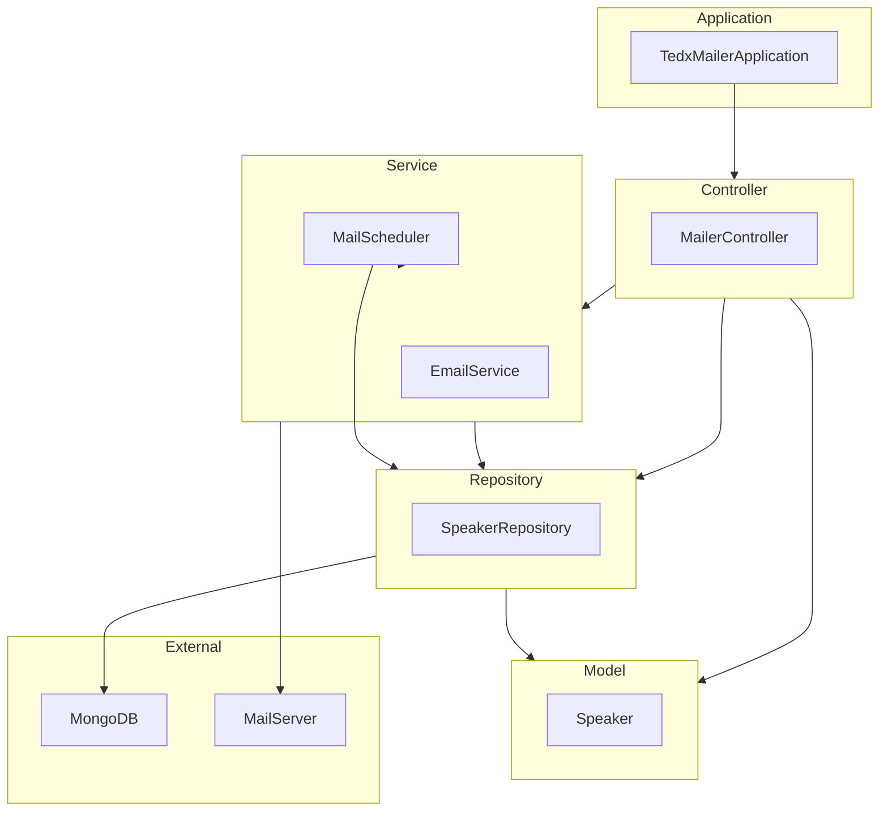

    

    <b>Automatic Architecture Diagrams from Code</b> 
    <a href="https://github.com/swark-io/swark">GitHub</a> • <a href="https://swark.io">Website</a> • <a href="mailto:contact@swark.io">Contact Us</a>

## Usage Instructions

1. **Render the Diagram**: Use the links below to open it in Mermaid Live Editor, or install the [Mermaid Support](https://marketplace.visualstudio.com/items?itemName=bierner.markdown-mermaid) extension.
2. **Recommended Model**: If available for you, use `claude-3.5-sonnet` [language model](vscode://settings/swark.languageModel). It can process more files and generates better diagrams.
3. **Iterate for Best Results**: Language models are non-deterministic. Generate the diagram multiple times and choose the best result.

## Generated Content
**Model**: GPT-4o - [Change Model](vscode://settings/swark.languageModel)  
**Mermaid Live Editor**: [View](https://mermaid.live/view#pako:eNp9Ur1uwyAQfhXr5uQFPFRq44xe6mylAzEXGxUDwlAlivLuvdRpbQMKE8f3w3cHV2iNQCiB6c5x2xeHiumC1hiO08GrtUq23EujJ-S-ai41AR8HFGfaK3QL2ufEQy2Yjsx2RntnFPFXXlTHSE5dU1Q1CxuL_OsZ_x2tGaU37pKIYignb9B9yxZn7X6gqMnpPX_T9ijC0_D7s0en-SJ_bXRnqrfIiewzNo-BF9vtSzLEuf6FF1OKkLjpCF519iiyuiUWZ565cZgEWXS_mmH2zpTxHxc2MKCjtxH0j68MfI8DMigLBgJPPCjP4EakYAX3WElODzJA6V3ADfDgTXPR7V_tTOh6KE9cjXj7AQaIA8U) | [Edit](https://mermaid.live/edit#pako:eNp9Ur1uwyAQfhXr5uQFPFRq44xe6mylAzEXGxUDwlAlivLuvdRpbQMKE8f3w3cHV2iNQCiB6c5x2xeHiumC1hiO08GrtUq23EujJ-S-ai41AR8HFGfaK3QL2ufEQy2Yjsx2RntnFPFXXlTHSE5dU1Q1CxuL_OsZ_x2tGaU37pKIYignb9B9yxZn7X6gqMnpPX_T9ijC0_D7s0en-SJ_bXRnqrfIiewzNo-BF9vtSzLEuf6FF1OKkLjpCF519iiyuiUWZ565cZgEWXS_mmH2zpTxHxc2MKCjtxH0j68MfI8DMigLBgJPPCjP4EakYAX3WElODzJA6V3ADfDgTXPR7V_tTOh6KE9cjXj7AQaIA8U)

